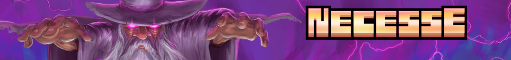

# Necesse

A Necesse Dedicated Server Docker image.

[](https://necessegame.com/)

https://store.steampowered.com/app/1169040/Necesse/

This project is not affiliated with Necesse.
It's a personal project to run a dedicated server on my docker stack.

This docker image uses the official dedicated server binary, downloaded from https://necessegame.com/server/.

More about Necesse hosting configuration: https://necessewiki.com/Multiplayer#Server_Parameters

# Tag policy

| Tag name            | Description                                                                            |
|---------------------|----------------------------------------------------------------------------------------|
| `latest`            | rolling release, Latest version                                                        |
| `<version>-<build>` | build names from server files page links. ex v1.0.1 build 20510020 is `1-0-1-20510020` |

# Env variables binding

| Env variable                 | Server parameters                    | Is mandatory or default value |
|------------------------------|--------------------------------------|-------------------------------|
| `NECESSE_PASSWORD`           | `-password`                          | [x]                           |
| `NECESSE_WORLD`              | `-world`                             | [x]                           |
| `NECESSE_PORT`               | `-port`                              | [ ] 14159                     |
| `NECESSE_SLOTS`              | `-slots`                             | [ ] ?                         |
| `NECESSE_PAUSE_WHEN_EMPTY`   | `-pausewhenempty` `<1/0>`            | [ ] 1                         |
| `NECESSE_GIVE_CLIENTS_POWER` | `-giveclientspower` `<1/0>`          | [ ] 0                         |
| `NECESSE_LOGGING`            | `-logging` `<1/0>`                   | [ ] 0                         |
| `NECESSE_ZIP_SAVES`          | `-zipsaves` `<1/0>`                  | [ ] 1                         |
| `NECESSE_LANGUAGE`           | `-language`                          | [ ]                           |

# Volumes

| Volume name | Description                              | Is mandatory |
|-------------|------------------------------------------|--------------|
| `/data`     | Server data, bound with `-datadir /data` | [x]          |

# Configs

| Configuration file | Description                                                                           | Is mandatory |
|--------------------|---------------------------------------------------------------------------------------|--------------|
| `/motd.txt`        | Welcoming message when user connect, if exists, bound with `-motd "$(cat /motd.txt)"` | [ ]          |

# Docker compose example

```compose
volumes:
    server_data:

configs:
  motd.txt:
    content: |
       Welcome to my server!

services:
  server:
    image: ghcr.io/docker-server-games/necesse:latest
    restart: unless-stopped
    stdin_open: true
    tty: true
    ports:
      - "14159:14159/udp"
    volumes:
      - server_data:/data
    configs:
      - motd.txt
    environment:
      - NECESSE_PASSWORD=<PUT YOUR PASSWORD HERE>
      - NECESSE_WORLD=my_world
```

```console
docker-compose up -d

# To run some commands as admin server
docker compose attach server

# If you use portainer or something like that
# find the container id and run the following command
docker attach <CONTAINER_ID>
```

## How to give you the Owner permissions

Once you are connected to the server with the game client, run the following command in the server console:

```console
players

# it will display the list of players
# > Slot 1: uniqueidnumber "MyPlayerName", latency: 4, level: surface,conn: 192.168.65.1:34731

permissions list
# > permissions list
# Permission levels:
# User, Creative Settings, Moderator, Admin, Owner, Server

# replace uniqueidnumber
permissions set uniqueidnumber Owner
```

🎉 you are now an owner, and you can do whatever you want in the server directly from the game client.

The help command in server and chat is cut with small pages, so it's not easy to find a command.
Here is a list of commands:

https://necessewiki.com/Multiplayer#Server_and_chat_commands

NB: I did not support `-owner` server parameter because I consider it as a security risk.
